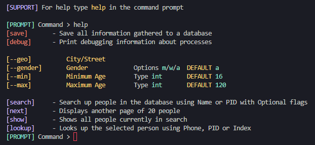

<a id="readme-top"></a>

<br />
<div align="center">
  <a href="https://github.com/axelwesselgren/mrkoll.se-scraper">
    
  </a>

<h3 align="center">Mrkoll.se Webscraper</h3>

  <p align="center">
    A webscraper for the intrusive Swedish personal database knwon as Mrkoll.se
  </p>
</div>

## About The Project


A Python-based web scraper designed to collect data from the website [mrkoll.se](https://mrkoll.se). It supports searching for individuals based on geolocation, age, and gender. Future updates will include the ability to save data to a database.

<p align="right">(<a href="#readme-top">back to top</a>)</p>

## Getting Started

Follow these steps to set up the project locally using a virtual environment and install the required dependencies.

### Prerequisites

Make sure you have Python 3.x installed. You can check with:

```sh
python --version
```

Or, depending on your system:

```sh
python3 --version
```

### Installation

1. **Clone the repository**
   ```sh
   git clone https://github.com/axelwesselgren/mrkoll.se-scraper.git
   cd mrkoll.se-scraper
   ```

2. **Create a virtual environment**
   ```sh
   python -m venv venv
   ```

3. **Activate the virtual environment**

   - On macOS/Linux:
     ```sh
     source venv/bin/activate
     ```

   - On Windows:
     ```sh
     venv\Scripts\activate
     ```

4. **Install required dependencies**
   ```sh
   pip install -r requirements.txt
   ```

You're now ready to run the scraper!

<p align="right">(<a href="#readme-top">back to top</a>)</p>


## Usage

To start the scraper, run:

```sh
python python/looker.py
```

### Command Prompt Interface

Once running, you’ll see a prompt like this:

```
[PROMPT] Command >
```

You can enter any of the following commands:

---

### 🔧 General Commands

| Command | Description |
|--------|-------------|
| `help`   | Show available commands |
| `save`   | Save all gathered information to a database (feature coming soon) |
| `debug`  | Print debug information about internal processes |

---

### 🔍 Search Filters (Optional Flags)

| Flag       | Description                | Type   | Default |
|------------|----------------------------|--------|---------|
| `--geo`    | Filter by city or street   | string | -       |
| `--gender` | Filter by gender (`m`, `w`, `a`) | char   | `a`     |
| `--min`    | Minimum age                | int    | `16`    |
| `--max`    | Maximum age                | int    | `120`   |

---

### 📚 Search & Results

| Command   | Description |
|-----------|-------------|
| `search`  | Search for people using name or personal ID (can include flags) |
| `next`    | Show the next page of 20 results |
| `show`    | Display all current search results |
| `lookup`  | Look up a specific person using phone number, PID, or result index |

---

### Example:

```
[PROMPT] Command > search --geo Stockholm --gender w --min 25 --max 35
[PROMPT] Command > show
[PROMPT] Command > lookup 3
[PROMPT] Command > save
```

<p align="right">(<a href="#readme-top">back to top</a>)</p>

## Roadmap

- [ ] Ensure project works
- [ ] Add proper documentation
- [ ] Restructue project
- [ ] Add ability to save data to a database

See the [open issues](https://github.com/axelwesselgren/mrkoll.se-scraper/issues) for a full list of proposed features (and known issues).

<p align="right">(<a href="#readme-top">back to top</a>)</p>

## Contributing

Contributions are what make the open source community such an amazing place to learn, inspire, and create. Any contributions you make are **greatly appreciated**.

If you have a suggestion that would make this better, please fork the repo and create a pull request. You can also simply open an issue with the tag "enhancement".
Don't forget to give the project a star! Thanks again!

1. Fork the Project
2. Create your Feature Branch (`git checkout -b feature/AmazingFeature`)
3. Commit your Changes (`git commit -m 'Add some AmazingFeature'`)
4. Push to the Branch (`git push origin feature/AmazingFeature`)
5. Open a Pull Request

<p align="right">(<a href="#readme-top">back to top</a>)</p>

## ⚠️ Disclaimer

**This project is intended for educational and research purposes only.**  
Use of this tool must comply with all applicable laws and the terms of service of the websites being accessed.  
The author does not condone or encourage any form of misuse, and assumes no liability for actions taken using this code.


## License

Distributed under the MIT license. See `LICENSE` for more information.

<p align="right">(<a href="#readme-top">back to top</a>)</p>
